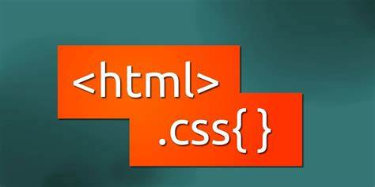

# GE-ProgramacaoEM-TurmaL

### Esse repositório irá armazenar o projeto desenvolvido no curso de formadores em ação (GE)

* O curso irá abordar programação por marcação  HTML5 e CSS3*, a partir da construção de um site, a princípio ficticio.

*  Email * 

### O Site:

O site será constituído de no mínimo 3 páginas. A primeira será a Home, na qual será apresentada a missão e o contexto geral de atuação da empresa. Na segunda,os produtos desenvolvidos serão apresentados e poderá existir a possibilidade de redirecionamento para cada um dos produtos. A última, será uma página de contato para interação com o usuário.

# 

